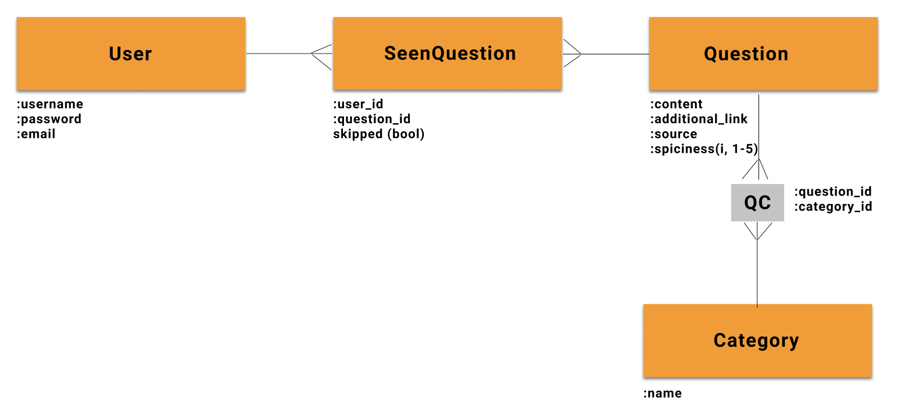

## Let's Change the Subject -- API

Let's change the subject is an app that facilitates conversations big and small between friends, coworkers, partners and strangers by suggesting conversation prompts.

***
## Table of contents
- [Getting Started](#getting-started)
    - [Node Installation on OS X](#node-installation-on-os-x)
    - [Node Installation on Linux](#node-installation-on-linux)
    - [Node Installation on Windows](#node-installation-on-windows)
- [Installation](#installation)
- [Start and Watch](#start-and-watch)
- [Domain Model](#domain-model)
- [Endpoints and Sample Responses](#endpoints-and-sample-responses)
    - [questions](#questions)
    - [categories](#categories)
    - [questions associated with a category](#category-questions)
    - [user and questions not seen by the user](#user-and-remaining-questions)
    - [add seen questions](#add-seen-questions)
    - [sign up](#sign-up)
    - [login](#login)
    - [autologin](#autologin)
- [Languages and tools](#languages-and-tools)
- [Contributing](#contributing)
    - [Known Issues](#known-issues)
- [License](#license)

## Getting Started
For development, you will only need Ruby on Rails and Postgres, which depends on Homebrew and Ruby. 

#### Node installation on OS X

You will need to use a Terminal. On OS X, you can find the default terminal in
`/Applications/Utilities/Terminal.app`.

1. Install [Homebrew](http://brew.sh/):

    ```
    $ ruby -e "$(curl -fsSL https://raw.githubusercontent.com/Homebrew/install/master/install)"
    ```

2. Install [Ruby](https://www.ruby-lang.org/en/):
```
    $ brew install rbenv ruby-build
    # Add rbenv to bash so that it loads every time you open a terminal
    $ echo 'if which rbenv > /dev/null; then eval "$(rbenv init -)"; fi' >> ~/.bash_profile
    $ source ~/.bash_profile

    # Install Ruby
    $ rbenv install 2.7.1
    $ rbenv global 2.7.1
    $ ruby -v
```
3. Install [Rails](https://rubyonrails.org/)
```
    $ gem install rails -v 6.0.2.2
```

4. Install [PostgreSQL](https://www.postgresql.org/)
```
    $ brew install postgresql
```

#### Node installation on Linux

Go on [official Rails website](https://gorails.com/setup/ubuntu/19.10) & follow the steps.

#### Node installation on Windows

Go on [official Rails website](https://gorails.com/setup/windows/10) & follow the steps.

## Installation

1. Clone the repo and cd into the folder:
```
    $ git clone https://github.com/luanesouza/backend-lets-change-the-subject.git
    $ cd backend-lets-change-the-subject
```
2. Install dependencies (gems)
```
    $ bundle
```
3. Create migrations, migrate and seed:
```
    $ rails db:create
    $ rails db:migrate
    $ rails db:seed
```

## Start and Watch

```
    $ rails s
```
***
## Domain model


## Endpoints and sample responses

This app uses API versioning. Currently, the calls can be made to `/api/v1/`. Below you will find available endpoints with sample responses:

### Questions

**Endpoint**: GET `/api/v1/questions`
**Action description**: Response will consist of 50 random questions from all categories
**Sample response**:
```
[
  {
    "id": 111,
    "content": "What fictional character is amazing in their book / show / movie, but would be insufferable if you had to deal with them in mundane everyday situations?",
    "additionalLink": "https://conversationstartersworld.com",
    "spiciness": 1
  },
  {
    "id": 130,
    "content": "If you were given an envelope with the the time and date of your death inside, would you open it?",
    "additionalLink": "https://conversationstartersworld.com",
    "spiciness": 1
  }
]
```

### Categories 
**Endpoint**: GET `/api/v1/categories`
**Action description**: Response will consist of all currently available categories.
**Sample response**:
```
[
  {
    "name": "friends"
  },
  {
    "name": "coworkers"
  }
]
```

### Category Questions
**Endpoint**: GET `/api/v1/categories/name-of-the-category`
**Action description**: Response will contain 50 random questions from the given category.
**Sample response**:
```
{
  "name": "friends",
  "questions": [
    {
      "id": 77,
      "spiciness": 1,
      "additionalLink": "",
      "content": "What's the most embarrasing thing you've ever said?"
    },
    {
      "id": 43,
      "spiciness": 1,
      "additionalLink": "",
      "content": "What is a thing you always wanted to learn but never got around to?"
    },
  ]
}
```

### User and Remaining Questions
**Endpoint**: GET `/api/v1/users/:id`
**Action description**: Response will provide information about the user, together with 100 random questions from each category that the user has not yet seen.
**Sample response**:
```
{
  "id": 1,
  "email": "xyz2020@gmail.com",
  "username": "xyz2020",
  "remainingFriendsQs": [
    {
      "id": 4,
      "spiciness": 2,
      "additionalLink": "https://ggia.berkeley.edu/practice/36_questions_for_increasing_closeness",
      "content": "Would you like to be famous? In what way?"
    },
  ],
  "remainingCoworkersQs": [
    {
      "id": 78,
      "spiciness": 1,
      "additionalLink": "",
      "content": "If you could have two of a body part, which one would you duplicate and why?"
    },
  ],
  "remainingPartnersQs": [
    {
      "id": 25,
      "spiciness": 1,
      "additionalLink": "https://ggia.berkeley.edu/practice/36_questions_for_increasing_closeness",
      "content": "Alternate sharing something you consider a positive characteristic of your partner. Share a total of five items."
    },
  ]
}
```

### Add Seen Questions
**Endpoint**: POST `/api/v1/seen_questions`
**Action description**: The body of the requests needs to contain: user_id, question_id and, in case the question was skipped, `skipped: true`.
**Sample OK response**:
```
tba
```
**Sample error response**:
```
tba
```

### Sign up
**Endpoint**: POST `/api/v1/users`
**Action description**: The body of the requests needs to contain: username, password, password_confirmation and email and these params need to be in accordance with our validations.
**Sample OK response**:
```
tba
```
**Sample error response**:
```
tba
```

### Login
**Endpoint**: POST `/api/v1/auth/login`
**Action description**: The body of the requests needs to contain: username and password.
**Sample OK response**:
```
tba
```
**Sample error response**:
```
tba
```

### Autologin
**Endpoint**: GET `/api/v1/auth/auto_login`
**Action description**: The body of the requests needs to contain a token.
**Sample OK response**:
```
tba
```
**Sample 401 error response**:
```
{
  "message": "Please log in"
}
```

## Languages and Tools

- [Ruby on Rails](https://rubyonrails.org/) 
- [PostgreSQL](https://www.postgresql.org/) - database
- [JWT](https://jwt.io/) - auth web tokens
- [Active Record](https://guides.rubyonrails.org/active_record_basics.html) - Object Relational Mapping system
- [Active Model Serializers](https://github.com/rails-api/active_model_serializers) - serialization

## Contributing
Pull requests are welcome. Please make sure that your PR is [well-scoped](https://www.netlify.com/blog/2020/03/31/how-to-scope-down-prs/).
For major changes, please open an issue first to discuss what you would like to change. 

### Known issues
Visit [issues](https://github.com/luanesouza/backend-lets-change-the-subject/issues) section.

### Contributors
<table>
  <tr>
    <td align="center"><a href="https://github.com/sylwiavargas"><br /><sub><b>Sylwia Vargas</b></sub></a><br /><a href="https://github.com/luanesouza/backend-lets-change-the-subject/commits?author=sylwiavargas" title="Code">💻</a> <a href="https://github.com/luanesouza/backend-lets-change-the-subject/issues/created_by/sylwiavargas" title="Bug reports">🐛</a><a href="https://github.com/sruti/covid19-riskfactors-app/commits/master/README.md" title="Documentation">📖</a><a href="#ideas-sylwia" title="Ideas, Planning, & Feedback">💡</a></td>
    <td></td>
    <td align="center"><a href="http://sruti.me/"><br /><sub><b>Annie Souza</b></sub></a><br /><a href="#infra-annie" title="Infrastructure (Hosting, Build-Tools, etc)">🚇</a> <a href="https://github.com/luanesouza/backend-lets-change-the-subject/issues?q=is%3Aopen+is%3Aissue+luanesouza" title="Bug reports">🐛</a><a href="#ideas-sruti" title="Ideas, Planning, & Feedback">💡</a></td>
    </tr>
</table>


## License
[MIT](https://choosealicense.com/licenses/mit/)